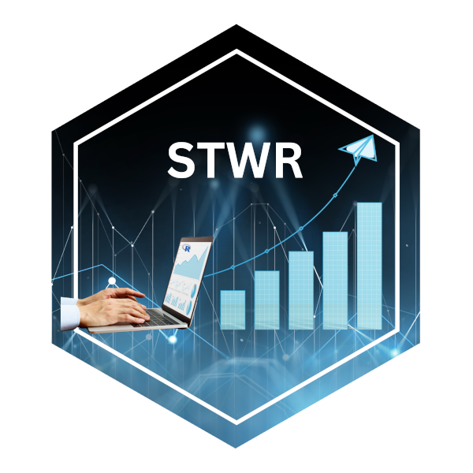

# Statistiktutorien mit R - Statistics Tutorials with R 

In diesem Repository finden sich kurze Tutorien zu verschiedenen statistischen Themen, 
welche in der Zeitschrift Kardiotechnik <https://dgfkt.de/zeitschriftkardiotechnik> 
erschienen sind.

This repository contains short tutorials on various statistical statistical topics 
published in the journal Kardiotechnik <https://dgfkt.de/zeitschriftkardiotechnik>.

## Die Tutorien - The Tutorials:

Die einzelnen Tutorien finden sich in den entsprechenden Ordnern (T1, T2, ...).

The individual tutorials can be found in the corresponding folders (T1, T2, ...).

T1: [Der Box- und Whisker-Plot - The Box- and Whisker-Plot (1/2022)](https://dgfkt.de/organisation/publikationen/statistik-teil-1-der-box-und-whisker-plot/)

T2: [Datenorganisation mit Tabellenkalkulationsprogrammen - Data Organization with Spreadsheet Programs (2/2022)](https://dgfkt.de/organisation/publikationen/statistik-teil-2-datenorganisation-mit-tabellenkalkulationsprogrammen/)

T3: [Konfidenzintervalle - Confidence Intervals (3/2022)](https://dgfkt.de/organisation/publikationen/statistik-teil-3-konfidenzintervalle/), [Supplement Bootstrap-Konfidenzintervalle](https://dgfkt.de/wp-content/uploads/Supplement-3-22.pdf)

T4: [Korrelationen - Correlations (4/2022)](https://dgfkt.de/organisation/publikationen/statistik-teil-4-korrelationen/)

T5: [Kontingenzkoeffizienten - Contingency Coefficients (1/2023)](https://dgfkt.de/organisation/publikationen/statistik-teil-5-kontingenzkoeffizienten/)

T6: [Methodenvergleiche - Comparisons of Methods (2/2023)](https://dgfkt.de/organisation/publikationen/statistik-teil-6-methodenvergleiche/)

T7: [Statistische Signifikanztests - Statistical Significance Tests (3/2023)](https://dgfkt.de/organisation/publikationen/statistik-teil-7-statistische-signifikanztests/)

T8: [t-Tests und Alternativen - t-Tests and Alternatives (4/2023)](https://dgfkt.de/organisation/publikationen/statistik-teil-8-t-tests-und-alternativen/)

T9: 1-Weg ANOVA - 1-Way ANOVA (1/2024)
